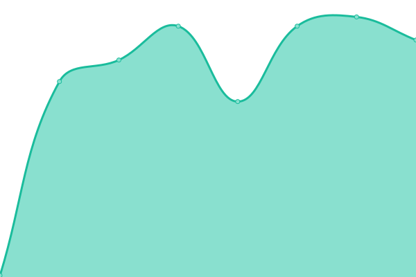

# [📈 Live Status](https://jhs.status.migraine.kr): <!--live status--> **🟩 All systems operational**

This repository contains the open-source uptime monitor and status page for [편두통케어](https://migraine.kr/), powered by [Upptime](https://github.com/upptime/upptime).

With [Upptime](https://upptime.js.org), you can get your own unlimited and free uptime monitor and status page, powered entirely by a GitHub repository. We use [Issues](https://github.com/MigraineKR/jhs.status/issues) as incident reports, [Actions](https://github.com/MigraineKR/jhs.status/actions) as uptime monitors, and [Pages](https://jhs.status.migraine.kr) for the status page.

<!--start: status pages-->
<!-- This summary is generated by Upptime (https://github.com/upptime/upptime) -->
<!-- Do not edit this manually, your changes will be overwritten -->
<!-- prettier-ignore -->
| URL | Status | History | Response Time | Uptime |
| --- | ------ | ------- | ------------- | ------ |
|  [jhsnet.net](https://www.jhsnet.net/) | 🟩 Up | [jhsnet-net.yml](https://github.com/MigraineKR/jhs.status/commits/HEAD/history/jhsnet-net.yml) | 

 1500ms
     
 | 

<a href="https://jhs.status.migraine.kr/history/jhsnet-net">100.00%</a>
    

|  [jhsnet.net/english](https://www.jhsnet.net/english.html) | 🟩 Up | [jhsnet-net-english.yml](https://github.com/MigraineKR/jhs.status/commits/HEAD/history/jhsnet-net-english.yml) | 

 144ms
     
 | 

<a href="https://jhs.status.migraine.kr/history/jhsnet-net-english">100.00%</a>
    

|  [zutsu-online.jp](https://zutsu-online.jp/) | 🟩 Up | [zutsu-online-jp.yml](https://github.com/MigraineKR/jhs.status/commits/HEAD/history/zutsu-online-jp.yml) | 

 690ms
     
 | 

<a href="https://jhs.status.migraine.kr/history/zutsu-online-jp">100.00%</a>
    

<!--end: status pages-->

[**Visit our status website →**](https://jhs.status.migraine.kr)

## 📄 License

- Powered by: [Upptime](https://github.com/upptime/upptime)
- Code: [MIT](./LICENSE) © [편두통케어](https://migraine.kr/)
- Data in the `./history` directory: [Open Database License](https://opendatacommons.org/licenses/odbl/1-0/)
